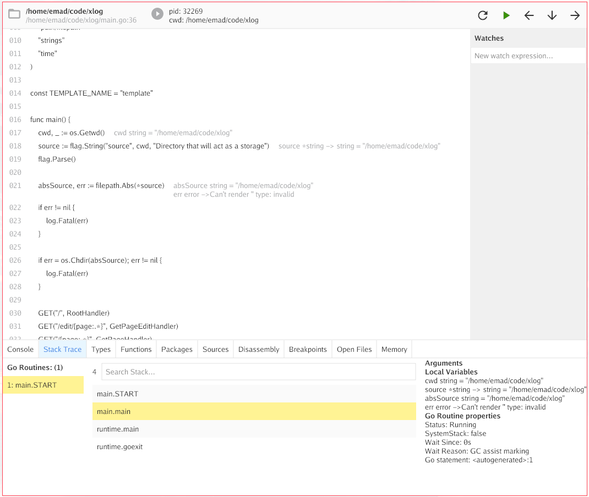

DEBUGGER
========

Golang debugger graphical user interface. Built on Delve debugger. It aims to provide a similar user experience to Chrome developer tools.



# Features

- Source code view
- Breakpoints (Add, remove, activate, deactivate)
- Disassmbly panel
- Watches
- List of functions
- List of types
- List of Open files by the process
- Show Process ID
- Shows Process current working directory
- Compiles go module executable or tests
- Recompile and restart the process when changes are detected
- Saves sessions for current project, with latest breakpoints
- Stack trace panel, listing all go routines
- List of packages, and links to package documentation
- List of source files
- Memory statistics

# Supported OSs

- Linux: tested on Archlinux machine with go-1.19/amd64

# Installation

## Prerequisites

- Project depends on Gio package. make sure you install it's dependencies https://gioui.org/doc/install
- Install `debugger` latest version using `go install`
```
go install github.com/emad-elsaid/debugger@latest
```

# Getting Started

- Run `debugger`
- Choose a directory of Go code where your main package exists
- Press continue button to start your program
- You can add Breakpoints at any time. it'll pause the program for a moment to set the breakpoint
- You can jump to any function from the functions panel or any file from source panel


# Dependencies

- fsnotify
- Delve
- Gioui

# Sessions

Sessions are saved all the time when a relevant change happens in the UI. sessions are saves in user config directory

On linux sessions are saved in `~/.config/debugger/sessions.json` clearing the session can be done by deleting this file.

# Contributing

## Code contributions

- Fork
- Branch
- Add proof of concept for your feature to get the conversation started
- Open Pull request with your changes
- Discuss the idea and the POC
- Continue until the PR is in a good shape for merging

## Feature requests

- Open an issue with the idea state the following:
  - Problem statement
  - List of solutions
  - Preferred solution
  - Why this solution was choosen?

# License

This project is published under the MIT license
